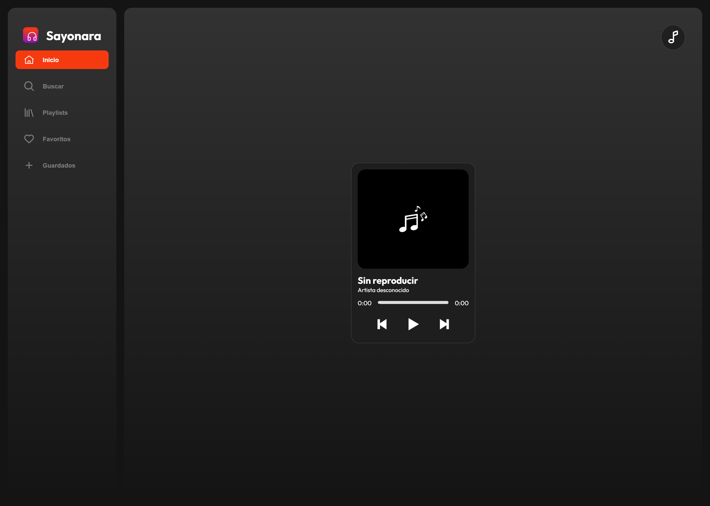
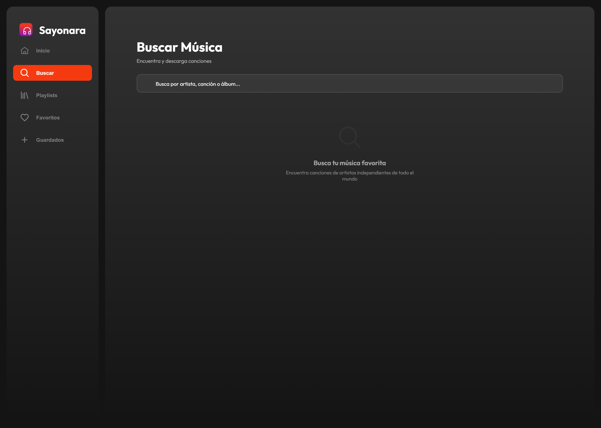
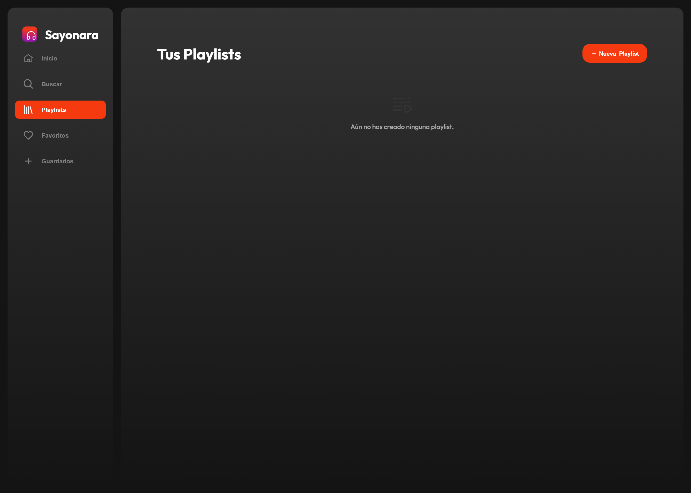
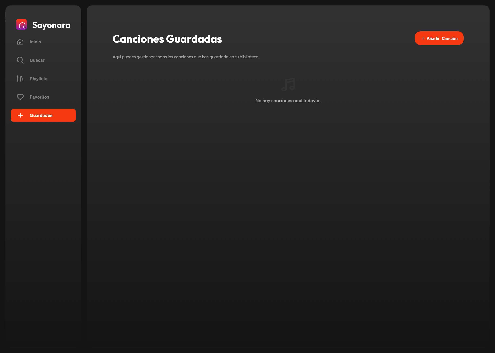
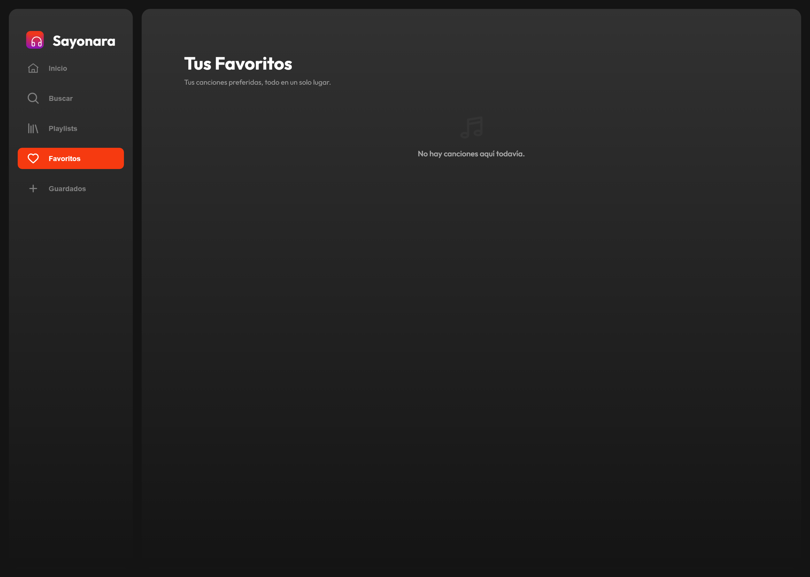

# Sayonara

**Reproductor de música autoalojado con integración de YouTube, enriquecimiento de metadatos con IA y letras sincronizadas.**

Proyecto personal desarrollado en mis ratos libres para explorar el desarrollo web full-stack con JavaScript vanilla, APIs del navegador e integraciones de IA.

---

## Tabla de contenidos

- [Descripción](#descripción)
- [Funcionalidades](#funcionalidades)
- [Tecnologías](#tecnologías)
- [Arquitectura](#arquitectura)
- [Cómo ejecutarlo](#cómo-ejecutarlo)
- [API](#api)
- [Capturas de pantalla](#capturas-de-pantalla)
- [Estado del proyecto](#estado-del-proyecto)

---

## Descripción

Sayonara es un reproductor de música que corre completamente en tu propia máquina. Puedes importar archivos de audio desde tu almacenamiento local o buscar canciones en YouTube y descargarlas como MP3 — la app se encarga del resto: obtiene los metadatos correctos (título, artista, álbum), descarga la portada del álbum y recupera las letras sincronizadas que se desplazan automáticamente mientras suena la canción.

Toda la biblioteca (canciones, playlists, favoritos) se guarda en el IndexedDB del navegador. No se necesita cuenta ni servidor externo.

---

## Funcionalidades

### Reproductor
- Reproducir / pausar, canción anterior / siguiente
- Barra de progreso interactiva sincronizada entre la vista principal y el reproductor fijo del pie de página
- Control de volumen con botón de silencio e ícono adaptativo
- **Fondo dinámico** — se extrae el color dominante de la portada del álbum con Color Thief y se aplica como gradiente detrás del reproductor

### Biblioteca
- Importar archivos de audio con el selector de archivos o **arrastrando y soltando** directamente en la app
- Lectura automática de etiquetas ID3 (título, artista, portada incrustada)
- Almacenamiento persistente en **IndexedDB** — la biblioteca sobrevive recargas y reinicios del navegador
- **Favoritos** — marca canciones con un corazón; los favoritos guardan su propio orden
- **Playlists** — crea playlists con nombre y selecciona canciones de tu biblioteca; reproduce toda la playlist en orden

### Integración con YouTube
- **Buscar** en YouTube directamente desde la app (10 resultados con miniatura, título y duración)
- **Descargar** cualquier resultado como MP3 (extracción solo de audio con yt-dlp + FFmpeg)

### Metadatos con IA
Después de descargar una canción, la app enriquece los metadatos automáticamente en tres pasos:

1. **Groq API (Qwen 3 32B)** — elimina el ruido típico de los títulos de YouTube (ej. "| Audio Oficial 4K HQ Remasterizado") y extrae un par limpio de `artista` / `canción`
2. **MusicBrainz** — busca la grabación canónica para obtener el título correcto, el nombre acreditado del artista y el álbum
3. **Cover Art Archive** — descarga la portada oficial del álbum en resolución completa

### Letras
- Obtiene letras sincronizadas por tiempo para la canción actual
- El panel de letras se desplaza automáticamente resaltando el verso actual mientras avanza la canción
- Caché de resultados para evitar peticiones repetidas
- Estado visual claro cuando no hay letras disponibles o el dispositivo está sin conexión

### Cola de reproducción
- Panel lateral con todas las canciones en cola
- Haz clic en cualquier entrada para saltar a esa canción
- Consciente del contexto: la cola refleja si estás reproduciendo desde tu biblioteca guardada, tus favoritos o una playlist específica

---

## Tecnologías

### Backend

| Tecnología | Versión | Rol |
|---|---|---|
| Node.js + Express | 5.x | Servidor de API REST |
| yt-dlp | latest | Extracción de audio de YouTube |
| FFmpeg | incluido | Conversión de audio a MP3 |
| Groq API (Qwen 3 32B) | — | Normalización de título y artista |
| MusicBrainz API | v2 | Metadatos musicales canónicos |
| Cover Art Archive | — | Portadas de álbumes |
| dotenv | 17.x | Variables de entorno |

### Frontend

| Tecnología | Rol |
|---|---|
| JavaScript vanilla (ES2020) | Toda la lógica de la aplicación — sin framework |
| HTML5 + CSS3 | Estructura de la UI y sistema de diseño propio |
| IndexedDB | Almacenamiento local persistente de canciones, playlists y favoritos |
| Web Audio API | Reproducción de audio nativa del navegador |
| [Color Thief](https://lokeshdhakar.com/projects/color-thief/) | Extracción del color dominante de la portada |
| [jsmediatags](https://github.com/aadsm/jsmediatags) | Lectura de etiquetas ID3 de archivos de audio locales |

---

## Arquitectura

```
Sayonara/
└── backend/
    ├── server.js            # Servidor Express — endpoints de descarga, búsqueda y metadatos
    ├── .env                 # Claves de API (no incluido en el repositorio)
    ├── ffmpeg/              # Binarios de FFmpeg para Windows
    ├── downloads/           # Almacenamiento temporal de MP3 descargados
    └── public/              # Archivos estáticos del cliente servidos por Express
        ├── index.html       # Estructura base de la aplicación de página única
        ├── scripts/
        │   └── app.js       # Toda la lógica de la interfaz
        ├── styles/
        │   └── styles.css   # Sistema de diseño y estilos de componentes
        └── assets/          # Íconos SVG y portada por defecto
```

**Patrón del frontend:** Aplicación de página única (SPA) con cambio de secciones en el cliente — sin librería de ruteo ni bundler. Las secciones se alternan con `display`; el estado se mantiene en variables de módulo sincronizadas con IndexedDB.

**Flujo de datos al descargar una canción:**

```
El usuario pega una URL de YouTube
    → POST /download  (el servidor ejecuta yt-dlp + FFmpeg)
    → MP3 devuelto como base64
    → POST /metadata  (Groq limpia el título → búsqueda en MusicBrainz → portada)
    → Canción guardada en IndexedDB con metadatos completos
    → La interfaz actualiza la lista de la biblioteca
```

---

## Cómo ejecutarlo

### Requisitos previos

- **Node.js** 18 o posterior
- **Python 3** con yt-dlp instalado:
  ```bash
  pip install yt-dlp
  ```
- Una **clave de API de Groq** gratuita — regístrate en [console.groq.com](https://console.groq.com)

### Instalación

```bash
git clone https://github.com/JuanPabloMendozaLopez/Sayonara.git
cd Sayonara/backend
npm install
```

Crea un archivo `.env` dentro de `backend/`:

```env
GROQ_API_KEY=tu_clave_de_api_aqui
```

### Ejecutar

```bash
node server.js
```

Abre [http://localhost:3000](http://localhost:3000) en tu navegador.

---

## API

Todos los endpoints son servidos por el backend de Express. El frontend los llama internamente.

| Método | Endpoint | Cuerpo / Query | Descripción |
|--------|----------|----------------|-------------|
| `POST` | `/download` | `{ url: string }` | Descarga una URL de YouTube y devuelve el MP3 en base64 |
| `GET` | `/search` | `?q=<consulta>` | Busca en YouTube y devuelve los 10 mejores resultados |
| `POST` | `/metadata` | `{ title, artist }` | Enriquece metadatos con Groq + MusicBrainz + Cover Art Archive |

### `POST /download`

```json
// Petición
{ "url": "https://www.youtube.com/watch?v=..." }

// Respuesta
{
  "fileName": "1778622398045-titulo_cancion.mp3",
  "file": "<MP3 codificado en base64>"
}
```

### `GET /search?q=consulta`

```json
// Respuesta — arreglo de hasta 10 resultados
[
  {
    "id": "dQw4w9WgXcQ",
    "title": "Rick Astley - Never Gonna Give You Up",
    "thumbnail": "https://...",
    "duration": 212,
    "url": "https://www.youtube.com/watch?v=dQw4w9WgXcQ"
  }
]
```

### `POST /metadata`

```json
// Petición
{ "title": "twenty one pilots - Morph (Official Audio)", "artist": "twenty one pilots" }

// Respuesta
{
  "title": "Morph",
  "artist": "twenty one pilots",
  "album": "Scaled and Icy",
  "cover": "data:image/jpeg;base64,..."
}
```

---

## Capturas de pantalla

| Inicio — Reproductor | Buscar |
|---|---|
|  |  |

| Playlists | Canciones Guardadas |
|---|---|
|  |  |

| Favoritos | |
|---|---|
|  | |

> Las capturas muestran la UI con la biblioteca vacía. Cuando hay una canción en reproducción, el gradiente de fondo se adapta dinámicamente al color dominante extraído de la portada del álbum.

---

## Estado del proyecto

Proyecto en desarrollo construido en mis ratos libres. Lo siguiente está completamente funcional:

- [x] Importar archivos de audio (selector de archivos + arrastrar y soltar)
- [x] Lectura de etiquetas ID3 (título, artista, portada incrustada)
- [x] Biblioteca persistente con IndexedDB
- [x] Favoritos y playlists
- [x] Cola de reproducción con conciencia del contexto
- [x] Búsqueda y descarga de MP3 desde YouTube
- [x] Enriquecimiento de metadatos con IA (Groq + MusicBrainz + Cover Art Archive)
- [x] Letras sincronizadas con desplazamiento automático
- [x] Fondo dinámico basado en la portada del álbum

Pendiente:
- [ ] Diseño responsive para móvil
- [ ] Streaming de audio en lugar de descarga completa
- [ ] Modos de repetición y aleatorio

---

## Licencia

MIT

```
                                  |
                                 |||
                                |||||
                  |    |    |   |||||||
                 )_)  )_)  )_)   ~|~
                )___))___))___)\  |
               )____)____)_____)\\|
             _____|____|____|_____\\\__
             \                       /
       ~^~^~~^~^~~^~^~~^~^~~^~^~~^~^~~^~^~~^~^~
               ~^~  todos a bordo!  ~^~
       ~^~^~~^~^~~^~^~~^~^~~^~^~~^~^~~^~^~~^~^~
```
